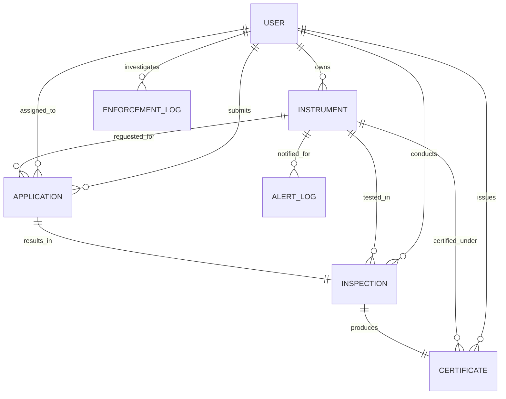

# e-MaapSetu System Architecture & Security Framework

**Unified Online Verification, Digital Certification & Lifecycle Management Platform for Weighing and Measuring Instruments**
*(Under the Legal Metrology Act, 2009 & Legal Metrology General Rules, 2011)*

---

## 1. High-Level Architecture Overview

e-MaapSetu is structured as a high-performance, modular, secure micro-monolith web and mobile platform. It provides role-scoped interfaces for five distinct stakeholders:
1. **Central & State Administrators (Controllers of Legal Metrology)**
2. **Legal Metrology Officers (LMOs / Field Inspectors)**
3. **Government Approved Test Centres (GATCs / Calibration Labs)**
4. **Traders, Enterprises & Instrument Owners (Jewelers, Petrol Stations, Logistics)**
5. **Citizens & Public Consumers (Public QR Scanning & Grievance Reporting)**

```
 ┌─────────────────────────────────────────────────────────────────────────────┐
 │                           PRESENTATION LAYER                                │
 │  ┌────────────────────────┐  ┌────────────────────────┐  ┌────────────────┐ │
 │  │ Responsive Web Portal  │  │ Mobile Field App (PWA) │  │ Public QR Scan │ │
 │  │ (Tailwind CSS, Charts) │  │ (Canvas Signatures)    │  │ (Validator)    │ │
 │  └───────────┬────────────┘  └───────────┬────────────┘  └────────┬───────┘ │
 └──────────────┼───────────────────────────┼────────────────────────┼─────────┘
                │                           │                        │
 ┌──────────────▼───────────────────────────▼────────────────────────▼─────────┐
 │                       API GATEWAY & SECURITY LAYER                          │
 │  • FastAPI REST Endpoints (Python 3.14)                                     │
 │  • Role-Based Access Control (RBAC Decorators & JWT Token Middleware)       │
 │  • Rate Limiting, Input Validation & Audit Logging                          │
 └──────────────────────────────────────┬──────────────────────────────────────┘
                                        │
 ┌──────────────────────────────────────▼──────────────────────────────────────┐
 │                           CORE SERVICES LAYER                               │
 │  ┌─────────────────────────┐ ┌─────────────────────────┐ ┌────────────────┐ │
 │  │ Metrology Rules Engine  │ │ Certificate Generator   │ │ Expiry Alert   │ │
 │  │ (MPE & Fee Schedule)    │ │ (ReportLab PDF & QR)    │ │ Scanner Engine │ │
 │  └─────────────────────────┘ └─────────────────────────┘ └────────────────┘ │
 │  ┌─────────────────────────┐ ┌─────────────────────────┐ ┌────────────────┐ │
 │  │ Application Workflow    │ │ GIS Heatmap Aggregator  │ │ Vigilance Cell │ │
 │  │ (Scheduling/Allocation) │ │ (Spatial Analytics)     │ │ (Grievances)   │ │
 │  └─────────────────────────┘ └─────────────────────────┘ └────────────────┘ │
 └──────────────────────────────────────┬──────────────────────────────────────┘
                                        │
 ┌──────────────────────────────────────▼──────────────────────────────────────┐
 │                         PERSISTENCE & STORAGE                               │
 │  • SQLite Database (Production-ready with ACID Transactions & Indices)      │
 │  • Cryptographic Key Store & Dynamic QR Generation Engine                   │
 │  • Document & Official Certificate PDF Vault                                │
 └─────────────────────────────────────────────────────────────────────────────┘
```

---

## 2. Role-Based Access Control (RBAC) Matrix

| Feature / Action | Admin / Controller | LMO (Inspector) | GATC Test Centre | Trader / Business | Public Citizen |
| :--- | :---: | :---: | :---: | :---: | :---: |
| **Macro Analytics & KPIs** | Full View | Circle View | Centre View | Profile View | No |
| **Instrument Registration** | Yes | Yes | Yes | Yes (Own) | No |
| **Submit Verification App** | Yes | No | No | Yes | No |
| **Allocate Applications** | Yes | Circle Lead | No | No | No |
| **Conduct Field Test & MPE** | Yes | Yes | Yes | No | No |
| **Issue Stamping & Cert** | Yes | Yes | Yes | No | No |
| **Download Official PDF** | Yes | Yes | Yes | Yes (Own) | Yes (Verified) |
| **Public QR Verification** | Yes | Yes | Yes | Yes | Yes |
| **Lodge Tampering Report** | Yes | Yes | Yes | Yes | Yes |
| **Execute Seizure / Raid Memo**| Yes | Yes | No | No | No |
| **Run Expiry Scanner** | Yes | Yes | No | No | No |

---

## 3. Cryptographic Security & Anti-Counterfeiting Framework

To eliminate fraudulent stamping and forged paper certificates, e-MaapSetu implements a **3-Layer Cryptographic Verification Protocol**:

1. **Digital Signature Token Generation**:
   - Each certificate's core attributes (Certificate Number, Serial Number, Digital Stamping Seal ID, Stamping Date, Valid Until Date) are canonically serialized:
     $$\text{Payload} = \text{CertNo} \parallel \text{SerialNo} \parallel \text{IssueDate} \parallel \text{ValidUntil} \parallel \text{SealID}$$
   - A keyed cryptographic digest is generated using HMAC-SHA256:
     $$\text{Token} = \text{HMAC-SHA256}(K_{\text{dept}}, \text{Payload})$$
2. **Dynamic High-Density QR Code**:
   - The generated QR code points to the public authenticity gateway: `https://emaapsetu.gov.in/verify/{CertificateNo}`
   - Any consumer, retailer, or vigilance squad can scan the QR code using any smartphone camera to check the live status directly against the state legal metrology ledger.
3. **Security Watermarked PDF Generation**:
   - Certificates are generated server-side using ReportLab with a high-resolution double security border, background `LEGAL METROLOGY CERTIFIED` watermark, and dual digital signature blocks.

---

## 4. Entity Relationship Schema



---

## 5. Deployment Methodology

1. **Standalone / Microservices Topology**:
   - The platform can run as a self-contained containerized service (Docker / Podman / Kubernetes) or on standard Linux/Cloud VM infrastructure.
   - Zero external third-party database dependency required for instant deployment, with full compatibility with PostgreSQL / MySQL when scaled.
2. **Offline-Ready PWA for Field Officers**:
   - Designed with local caching capabilities, touch-friendly UI, and camera integrations for seamless rural and suburban inspections with low network connectivity.
